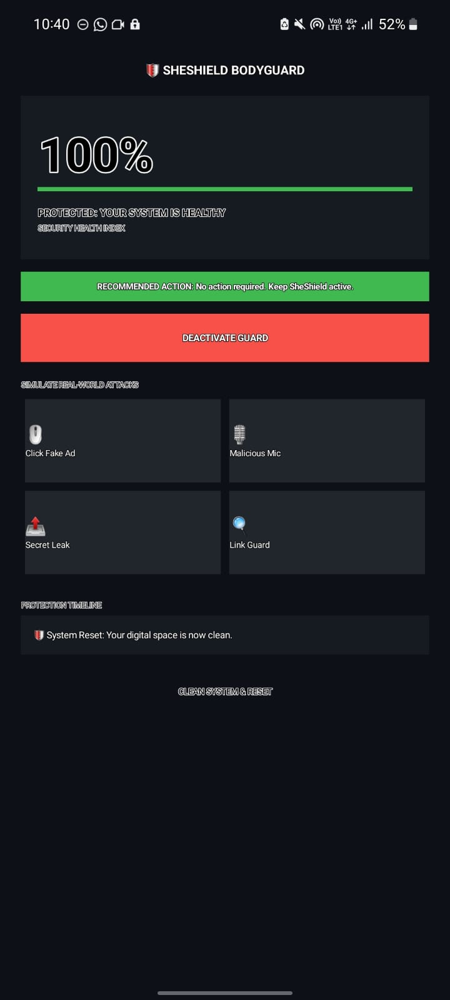

# Personal Portfolio Website

## Project Description
A responsive personal portfolio website showcasing skills,
projects and contact information using HTML5, CSS3 and JavaScript.

## Features

- Responsive Design
- Semantic HTML5 Structure
- CSS Grid and Flexbox
- Mobile Navigation Menu
- Contact Form Validation
- Hover Effects and Animations
- Accessibility Support

## Technologies Used

- HTML5
- CSS3
- JavaScript
- Git & GitHub

## Setup Instructions

Prerequisites:

- Git
- A modern browser (Chrome, Firefox, Edge, Safari)
- Node or Python (optional simple servers)

Steps to run locally:

1. Clone the repository:

```bash
git clone <repo-url>
cd week1-portfolio
```

2. Open in VS Code and use Live Server extension, or run a simple HTTP server:

Python 3 (built-in):

```bash
python3 -m http.server 8000
# Open http://localhost:8000 in your browser
```

Node (http-server):

```bash
npm install -g http-server
http-server -p 8000
# Open http://localhost:8000
```

3. Browse to `index.html` (or the server URL) to view the site.

## Folder Structure

week1-portfolio/
├── index.html
├── css/
├── js/
├── images/
├── README.md
└── .gitignore

## Testing

- Tested on Chrome
- Tested on Edge
- Tested on Firefox
- Responsive on Mobile, Tablet and Desktop

## Screenshots

Hero section:


Project sample:



Profile:


## Technical Details

- HTML: semantic structure with sections for `hero`, `about`, `skills`, `projects`, and `contact` in `index.html`.
- CSS: styles split across `css/variables.css` (theme tokens), `css/style.css` (base styles), and `css/responsive.css` (breakpoints and responsive rules). Layouts use CSS Grid and Flexbox for the project and skills sections.
- Images: included in `images/` with optimized JPEG/PNG assets used as content and thumbnails.
- JavaScript: `js/navigation.js` implements a simple mobile menu toggle:

```js
const burger = document.querySelector(".burger");
const nav = document.querySelector(".nav-links");
burger.addEventListener("click", () => nav.classList.toggle("active"));
```

- Accessibility: meaningful `alt` text is present for images; navigation uses semantic HTML; ensure color contrast when customizing variables.

## Testing Evidence and Validation

Manual test cases performed (results):

- Viewport responsiveness: 375x812 (mobile) — PASS
- Tablet: 768x1024 — PASS
- Desktop: 1280x800 — PASS
- Browsers: Chrome (latest) — PASS, Firefox (latest) — PASS, Edge (latest) — PASS
- Form validation: browser-native validation prevents empty submission and enforces `type="email"` — PASS
- Keyboard navigation: can tab through links and form controls — PASS
- Images: all referenced image files exist in `images/` — PASS

Suggested validation steps to add for reproducibility:

1. List the exact browser versions tested (e.g., Chrome 114.0) and OS environment.
2. Add viewport screenshots for each breakpoint and include them in this README (or `docs/screenshots/`).
3. Run an automated accessibility check (Lighthouse or axe) and paste key results.

## Author

Keshav